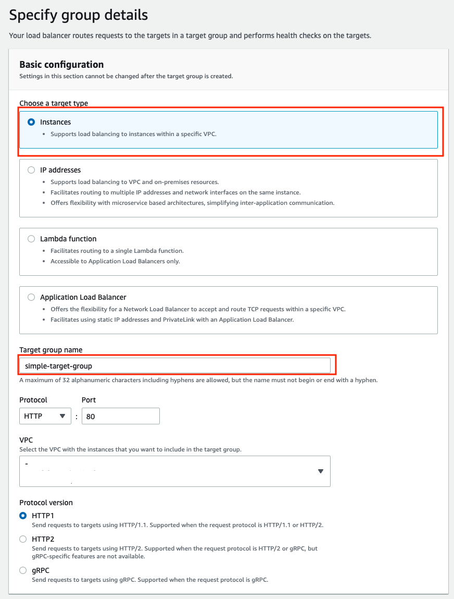

# EC2 - HTTPS 적용하기

## 1. AWS EC2 로드밸런서로 이동해서 로드밸러서 생성을 클릭 후 Application Load Balancer 클릭

## 2. 다음 단계로는 정보를 입력한다

### 1. Basic configuration

- Basic configuration에서는 위의 이미지처럼 빨간 박스(로드밸런스 네임)만 입력한다.

### 2. Network mapping

- Network mapping에서는 Mapping 부분에서 ap-northeast-2a, ap-northeast-2c 선택한다.
- ap-northeast-2a, ap-northeast-2\* 은 가용영역이다.
- 모든 사용자에게 a,b,c,ㅇ 가 같은 영역은 아니다.
- 누군가에게는 a가 용인 센터일 수 있고, 누군가에게는 서울 센터일 수 있다.

### 3. Security groups

- Security groups에서는 보안 그룹을 선택해주면 된다.
- 필자는 아래와 같이 만들어서 처리해주었음.(그냥 로드밸런스로 하나 생성함)
- 

### 4. Listener and routing

- HTTP:80, HTTPS:443을 추가한다
- Default SSL certificate는 생성한 인증서를 선택해주면 된다.
- Default action은 타켓그룹을 선택하면 되는데 없다면 생성하면된다.

#### 4-1 타켓 그룹 생성

- 위처럼 입력 또는 선택 후 로드밸런서를 생성하자

## 로드밸런서를 생성후 Route53에서 로드밸런서를 등록해줘야함.

- Route 53으로 이동해서 해당 호스팅에 가서 라우팅 추가를 한다.
  
  
