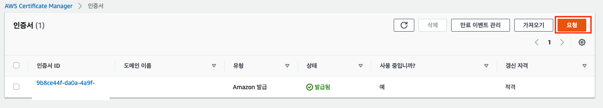
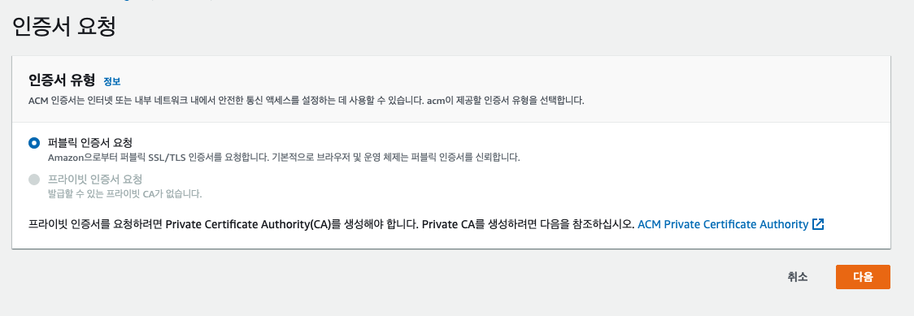
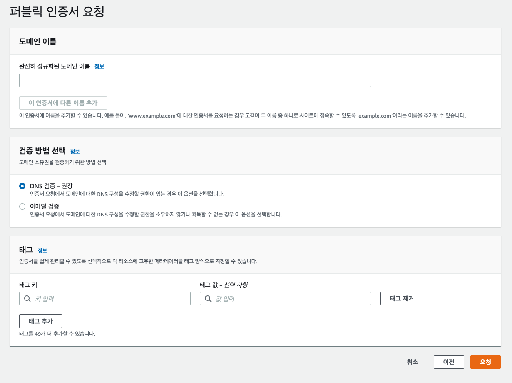
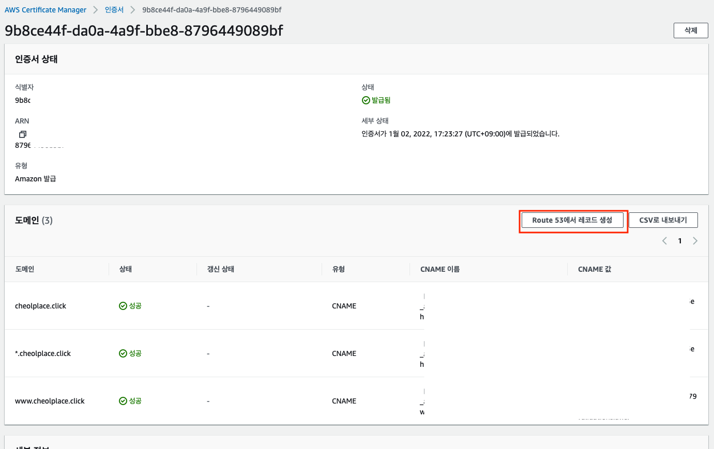

# EC2 - 인증서 발급

## 1. AWS Certificate Manager로 이동

- 아래 이미지 처럼 나오거나 인증서가 없다면 인증서 만들기 페이지가 나온다.
- 그래서 인증서 요청 또는 아래 이미지의 주황색 요청 버튼을 클릭한다.
  

## 2. 다음 단계는 아래 이미지이며 바로 다음을 클릭한다.

## 3. 다음 단계이다.

- 도메인이름 부분만 입력하면 된다.
  > 아래처럼 input박스에 입력하고 이 인증서에 다른 이름 추가 버튼을 클릭해서 추가할 도메인을 추가하면 된다.
  >
  > ## 예시
  >
  > - test.com
  > - \*.test.com
  > - www.test.com

## 4. 위처럼 인증서를 생성 후 해당 인증서로 이동

- Route S3에서 레코드 생성 버튼을 클릭해서 해당 도메인에 레코드를 생성한다.
