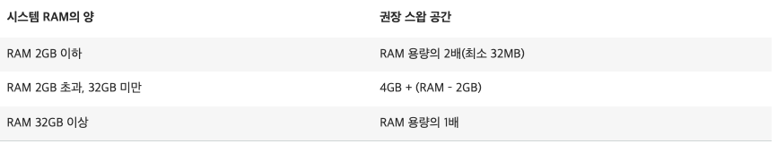
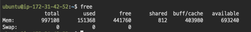
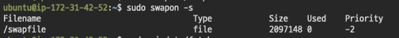
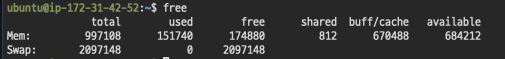

# EC2 메모리 스왑

- 하드 드라이브의 파티션을 사용하여 Amazon EC2 인스턴스에서 스왑 공간으로 사용할 메모리를 할당

## 스왑 공간 크기 계산



## 설정

- 프리티어는 RAM이 1GB이므로 2GB 정도로 생각하자
- https://aws.amazon.com/ko/premiumsupport/knowledge-center/ec2-memory-swap-file/
- 설정 전

  

1. swap 메모리 할당

```
sudo dd if=/dev/zero of=/swapfile bs=128M count=16
```

2. 스왑 파일에 대한 읽기 및 쓰기 권한

```
sudo chmod 600 /swapfile
```

3. Linux 스왑 영역을 설정

```
sudo mkswap /swapfile
```

4. 스왑 공간에 스왑 파일을 추가하여 스왑 파일을 즉시 사용할 수 있도록 합니다.

```
sudo swapon /swapfile
```

5. 프로시저가 성공적인지 확인합니다.

```
sudo swapon -s
```



6.  /etc/fstab 파일을 편집하여 부팅 시 스왑 파일을 시작(편집기에서 파일을 엽니다)

```
sudo vi /etc/fstab
```

파일 끝에 다음 줄을 새로 추가하고 파일을 저장한 다음 종료합니다.

```
/swapfile swap swap defaults 0 0
```

- 설정 후


