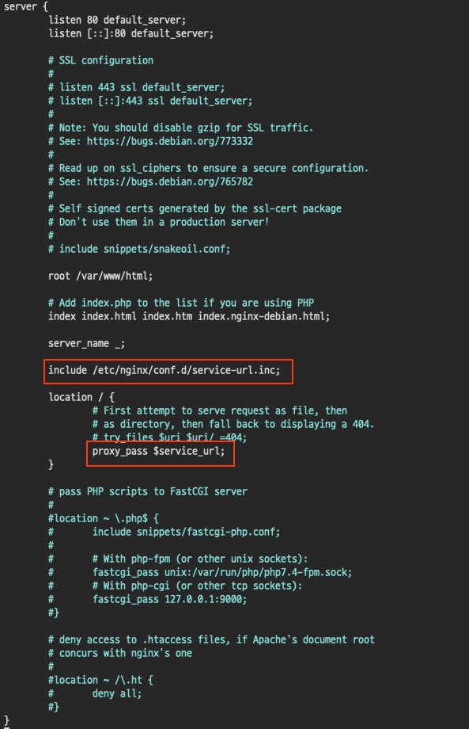

# 무중단 배포 - NGINX Setting

1. NGINX 설치

```
# 설치
sudo service nginx start
# 실행
sudo service nginx start
# 확인
service status nginx or systemctl status nginx
```

2. /etc/nginx/sites-enabled/default 수정

   - 위의 명령어를 통해 default 파일 수정

   ```
   sudo vi /etc/nginx/sites-enabled/default
   ```

   - 아래의 이미지의 빨간 박스 처럼 코드 추가

   ```
   include /etc/nginx/conf.d/service-url.inc;
   proxy_pass $service_url;
   ```

   

   - NGINX 재시작

   ```
   sudo service nginx restart
   ```
