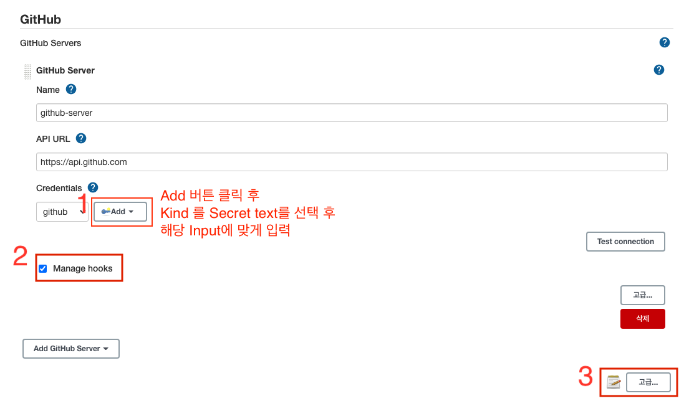
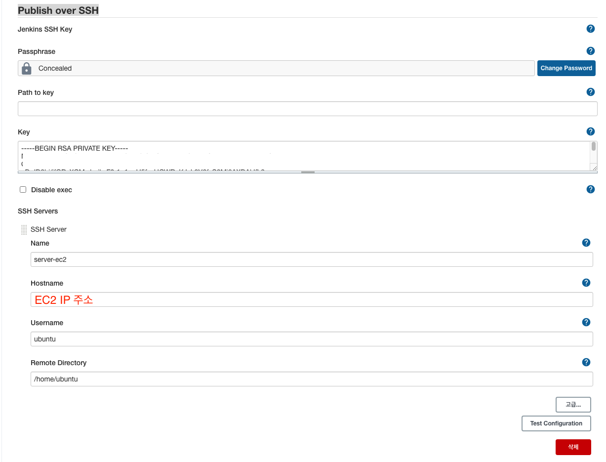
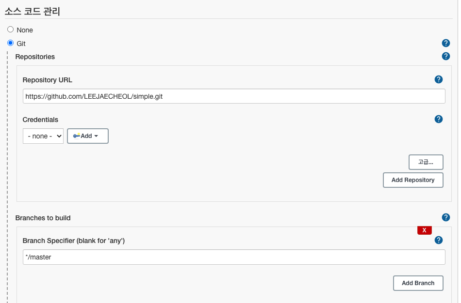
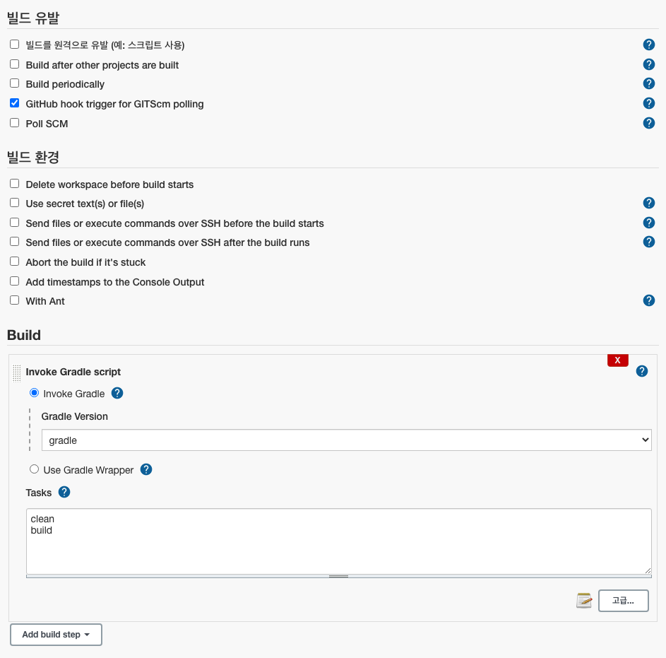
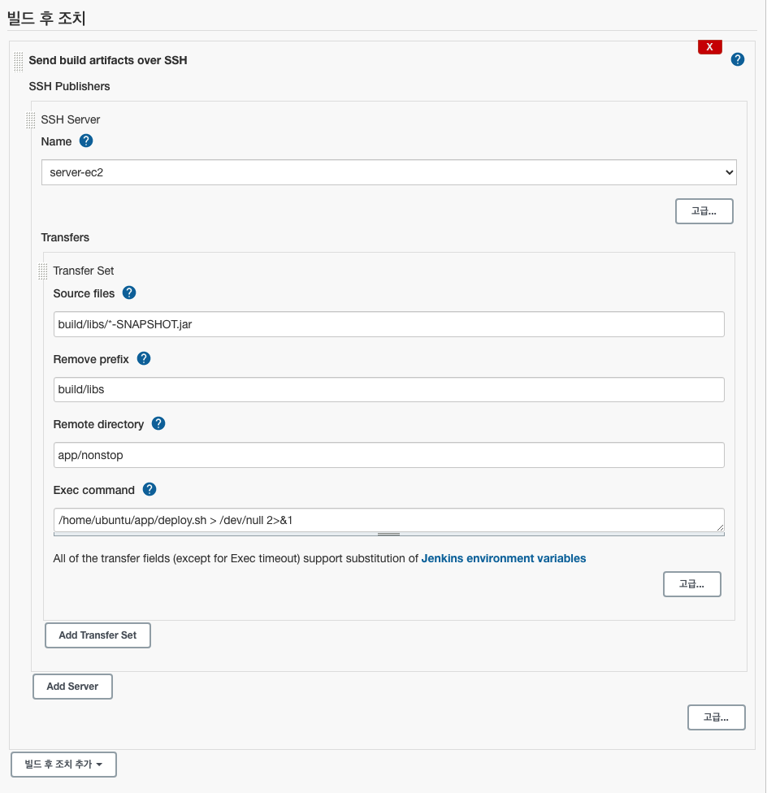

# 무중단 배포 - Jenkins

- ## 깃허브 연동

  - 프로필 선택 -> Settings -> Developer settings -> Personal access tokens -> new token
  - Jenkins 관리 > 시스템 설정 -> Github 섹션에서 Add Github Server > Github Server를 클릭
    
    1.  1번 Add버튼을 클릭해서 Credentials를 추가하고 추가한 Credentials를 선택
    2.  Manage hooks 를 선택
    3.  3번 고급 버튼을 클릭하면 Re-register hooks for all jobs 버튼이 생긴다.
        - Re-register hooks for all jobs 버튼을 클릭하면 해당 레포지토리의 webhook이 추가된다.

- ## Publish over SSH

  - Publish over SSH 설치
    - 젠킨스 관리 -> 플러그인 관리 로 들어가 Publish Over SSH 플러그인 을 설치
    - 젠킨스 관리 -> 시스템 설정 으로 들어가 Publish over SSH 설정
      

- ## Item 생성
  - Freestyle project
  - 
    
    
