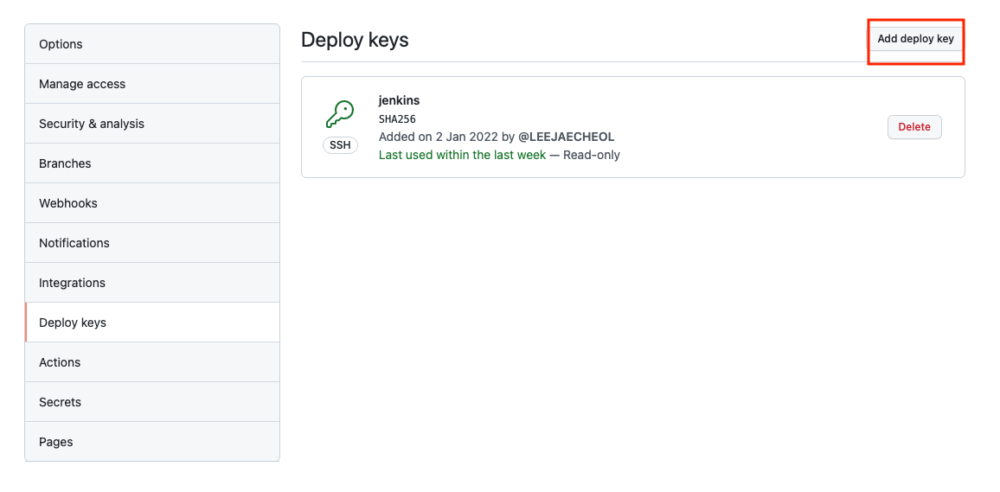
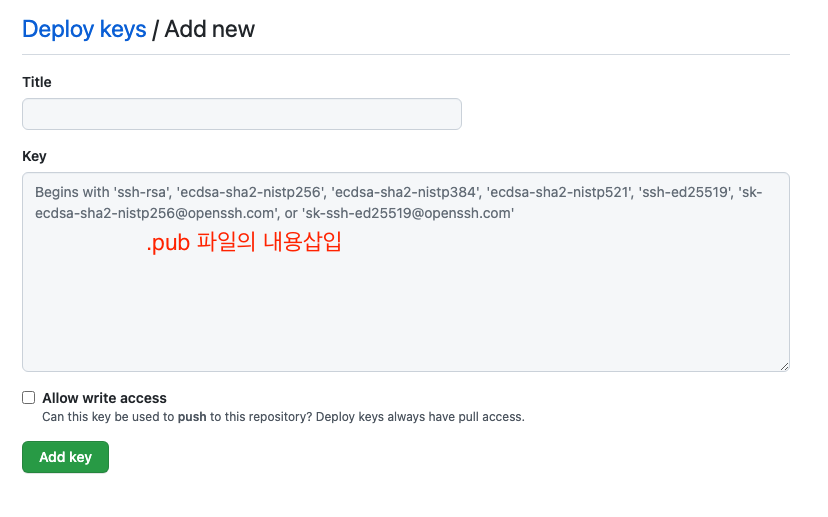
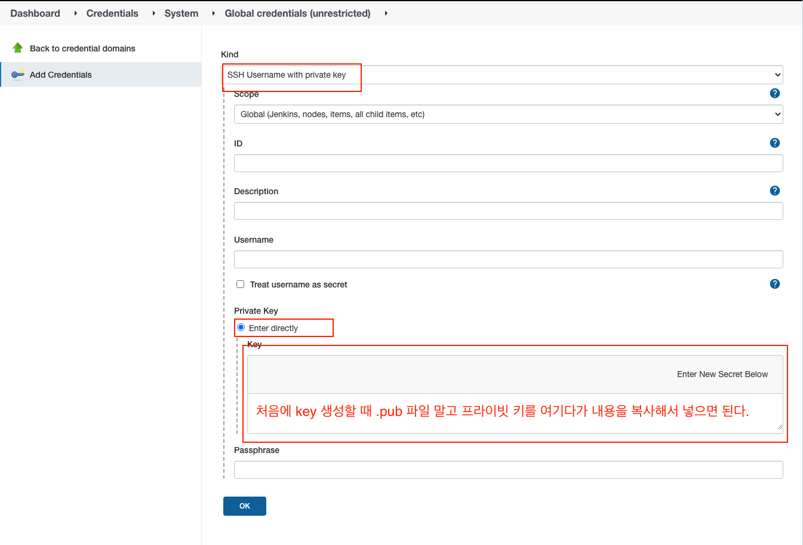
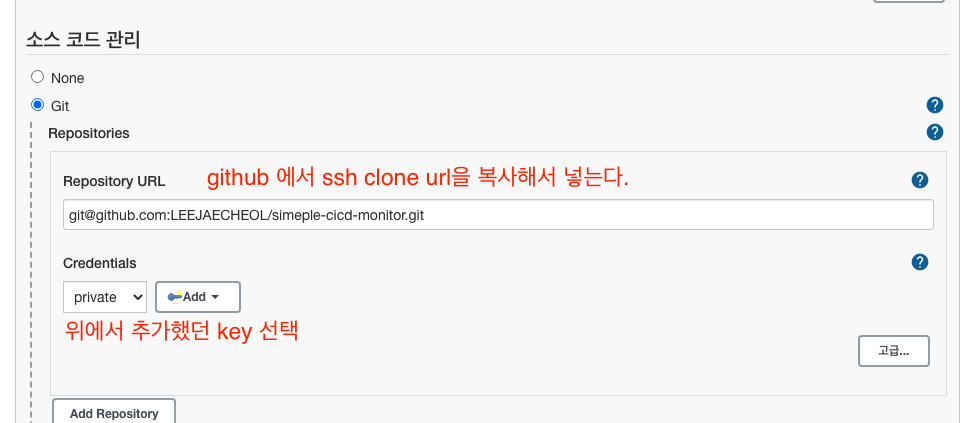

# 무중단 배포 - Private Repository 연동

## key 생성

```
> ssh-keygen
Generating public/private rsa key pair.
Enter file in which to save the key (): 경로 및 파일
Enter passphrase (empty for no passphrase):
Enter same passphrase again:
Your identification has been saved in 경로 및 파일.
Your public key has been saved in 경로 및 파일.pub.
The key fingerprint is:

The key's randomart image is:
```

## GITHUB 해당 레포지토리에 Deploys Keys 추가




## Jenkins 설정

- Jenkins 관리 > Manage Credentials > System > Global credetials > Add Credentials



## Jenkins Item 구성


